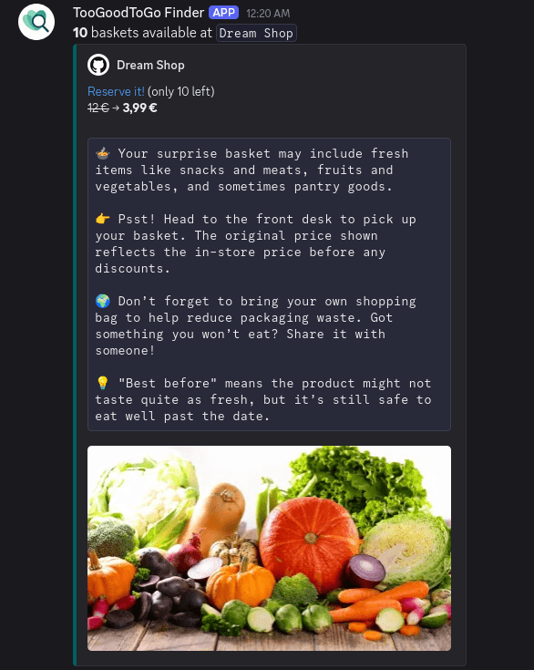

<table>
<tr>
<td></td>
<td>

# TooGoodToGo Finder  
Receive a notification when a new basket becomes available on <strong>TooGoodToGo</strong>!

</td>
</tr>
</table>

## 🚀 How it work
TooGoodToGo Finder retrieves your account's favorite surprise bags and monitors their availability.
When a new basket becomes available, the tool sends you a notification.



## 🛠️ Features
* Datadome Cookie Generation Bypass
* Session Management via Realistic TLS Fingerprint
* API Wrapper for TooGoodToGo
* Custom Logger with log file

## 📦 Installation

Docker support should arrive soon.

1. **Clone the repository**

  ```bash
  git clone https://github.com/etienne-hd/tgtg-finder.git
  cd tgtg-finder
  ```

2. **Install dependencies**
  It's recommended to use a virtual environment:

  ```bash
  python -m venv venv
  source venv/bin/activate  # or `venv\Scripts\activate` on Windows
  pip install -r requirements.txt
  ```

## ⚙️ Configuration

A [config.py](config.py) file is provided by default in the project.

It contains the basic parameters for running the TooGoodToGo client. Here's an overview of its contents:

```python
IOS_VERSION = "18.5"
IPHONE_MODEL = "15"
COUNTRY_CODE = "FR"
BASE_URL = "https://apptoogoodtogo.com/api"
POLLING_TIMEOUT = 120  # seconds to wait for email confirmation
POLLING_SLEEP_TIME = 5  # delay between each polling attempt
```

You can adjust values like `IOS_VERSION` or `POLLING_TIMEOUT` as needed.

## ▶️ Usage

1. **Run the script**
  Here's an example of how to use the client in a script:

  ```python
  from api import Client, Bag
  from api.logger import logger
  
  import time
  import random
  
  def trigger_webhook(bag: Bag):
      logger.info(f"{bag.display_name} - {bag.items_available}")
  
  def main():
      email = "you@example.com"
      client = Client()
  
      client.login(email=email)
      if not client.is_connected:
          logger.warning("Client login failed: not connected.")
          return
      
      logger.info("Client successfully connected. Starting favorite bag     monitoring...")
  
      while True:
          try:
              bags = client.get_favorites()
              logger.info(f"Retrieved {len(bags)} favorite bags.")
  
              for bag in bags:
                  if bag.items_available > 0:
                      trigger_webhook(bag=bag)
          except Exception as e:
              logger.exception(f"Error while retrieving favorite bags: {e}")
              time.sleep(60)
          time.sleep(random.randint(30, 60)) # Recommended time to avoid 403    errors
  
  if __name__ == "__main__":
      main()
  ```

2. **Automate notifications (optional)**
  You can integrate your own notification system (email, Discord webhook, Telegram bot, etc.) using the `bag.item.items_available` attribute to detect when new stock appears.
  Take a look at the [examples](examples/).

## ⚠️ Disclaimer
This project is an unofficial tool created for **educational and experimental purposes only**.

* **No affiliation**: This project is **not affiliated, associated, authorized, endorsed by, or in any way officially connected with Too Good To Go or any of its subsidiaries or affiliates**. All trademarks, service marks, logos, and images remain the property of their respective owners.

* **Violation of Terms**: Too Good To Go explicitly forbids the use of their platform in the manner this tool operates. Their Terms and Conditions state:
  *"The Consumer must not misuse the Platform (including hacking or 'scraping')."*

* **Use at your own risk**: If you use this tool, you do so entirely at your own risk. Too Good To Go may respond by (temporarily) blocking your access to the platform and may even delete your account.

